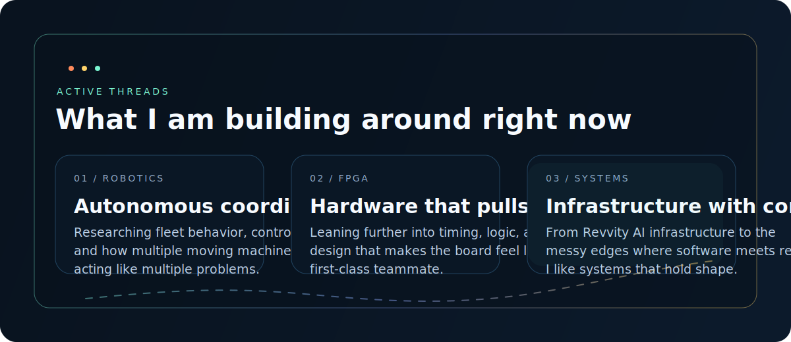
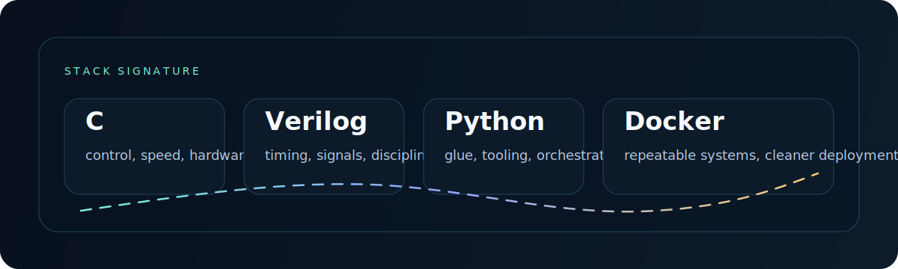

<div align="center">
  
</div>

<p align="center">
  Computer engineer with a systems brain, a builder's tempo, and a soft spot for elegant machinery.
</p>

<p align="center">
  I like work that feels alive: robot fleets, FPGA pipelines, infrastructure that stays calm under load, and software that earns its keep.
</p>

<p align="center">
  <a href="https://jonathanlyashko.com/">Website</a> |
  <a href="https://www.linkedin.com/in/jonathan-lyashko/">LinkedIn</a> |
  <a href="mailto:jlyashko@uwaterloo.ca">Email</a>
</p>

<div align="center">
  
</div>

## About

I think like a computer engineer first.

That usually means I care less about looking busy and more about how the whole machine behaves: control flow, interfaces, failure modes, timing, deployment, observability, and what happens when a nice demo turns into a real system.

Recently that has shown up in two very different but related arenas:

- building AI infrastructure at Revvity
- coordinating autonomous robot fleets as a research assistant at the University of Waterloo
- spending current cycles on robotics and FPGA work because both reward precise thinking and punish hand-wavy engineering

## Signal

<div align="center">
  
</div>

```text
Primary languages: C, Verilog, Python
Useful machinery: Docker
Engineering bias: systems thinking, low-level control, infrastructure with sharp edges
Operating mode: build fast, reason carefully, keep it legible
```

## Current Runtime

```c
typedef struct {
  char *name;
  char *role;
  char *mission;
} system_node;

system_node jonathan[] = {
  {"Revvity", "AI Infrastructure", "Build systems that can carry serious workloads"},
  {"University of Waterloo", "Research Assistant", "Coordinate autonomous robot fleets"},
  {"Right now", "Robotics + FPGA", "Push further down the stack and make the hardware count"}
};
```

## Contact

If something you are building involves autonomy, infrastructure, hardware-software boundaries, or just an interesting systems problem, I will probably want to hear about it.

<p align="center">
  <a href="mailto:jlyashko@uwaterloo.ca">jlyashko@uwaterloo.ca</a>
</p>
